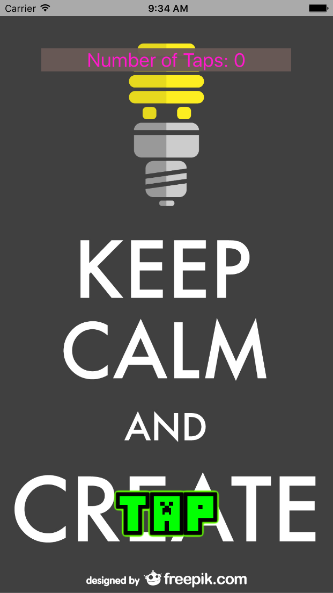

#Tapper:

Tapper is one of the first apps that I will be building for iOS using swift. The idea comes from a online tutorial. However, the implementation will be entirely up to me based on what I remember from my Objective C days regarding iOS development using story boards.

###How to play the game:
1. Either type in the number of taps that you want to play for or click play to start with the default 10 taps.
2. As soon as click the TAP button for the first time, a timer starts reducing your score.
3. Keep tapping as fast as you can to stop the timer while maintaining the most amount of points.
4. As soon as the final tap is reached, it will go back to the game over screen and summarize the last play.

###Screenshots:

###Attribution:

[Load Screen Logo][1]

[Menu Screen Logo][2]

[1]:http://www.freepik.com/free-vector/picking-the-right-one_764838.htm "Designed by Freepik"
[2]:http://www.freepik.com/free-vector/keep-calm-and-create-poster_716072.htm "Designed by Freepik"
